# Project 3

## Purpose of the task
In this task I am using ScrollView component on first two screens, showing different flexbox styles. On the third screen I am using TouchableOpcaity and TouchableHighlight components, to show the difference between two. I have also added a function that displays WebView in another container on this screen, after touching Highlight component. The webview is showing us youtube website with Rick Astley song - Never gonna give you up. On the fourth screen, I have created swipeable gallery, which allows to swipe left and right.
On the fifth screen I have additionally implemented Pressable component, which counts how many times I have clicked on the component.

## Technologies used
I used **React Native** and **Expo** to write the app, and I created everything in **VSCode**. My testing device was my *Android* phone.
## Screen 1, ScrollView, with Column style flexbox:
 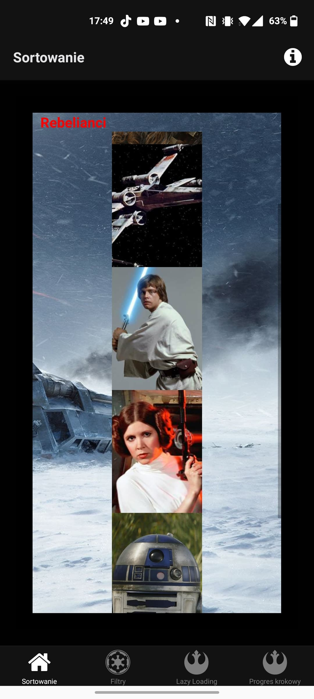
 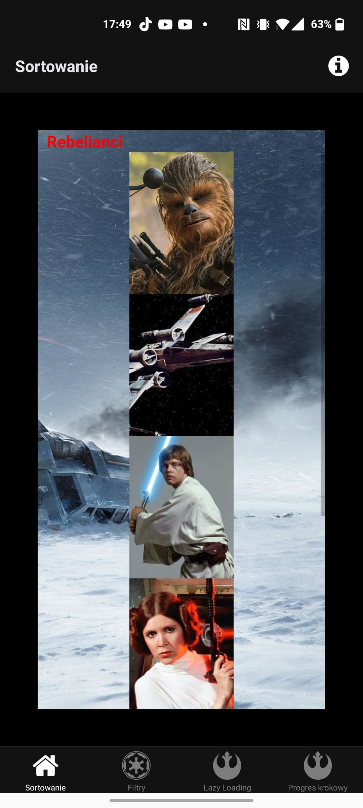
 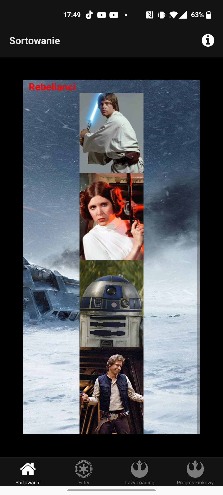
## Screen 2, ScrollView, with double row + column style flexbox:
 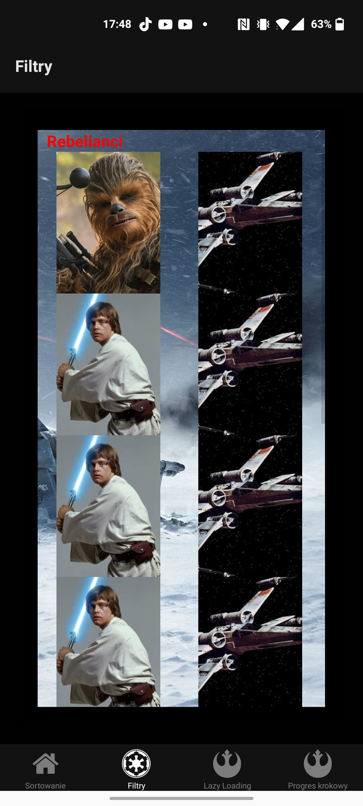
 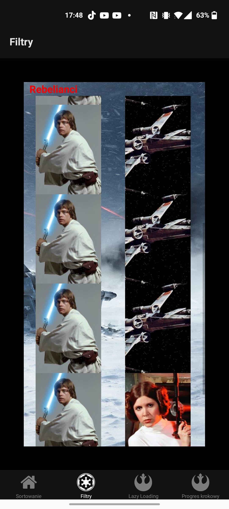
 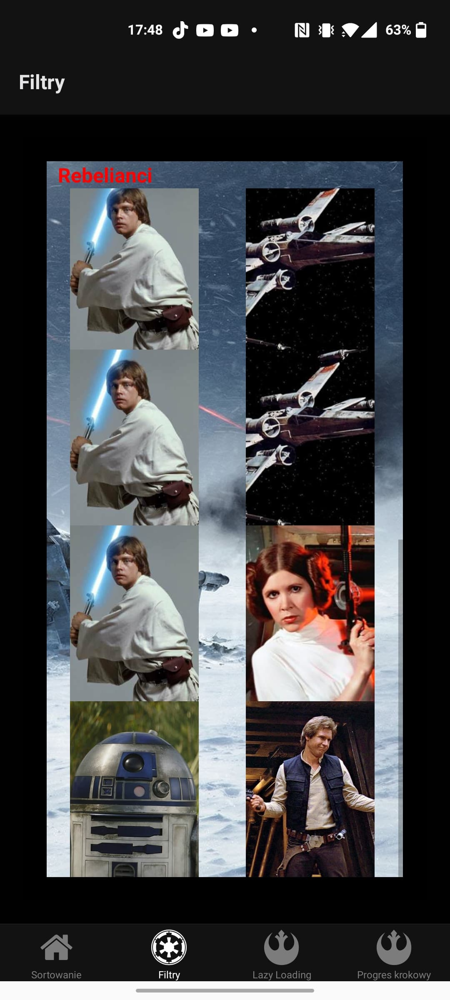
 ## Screen 3, TouchableOpacity and Highlight
 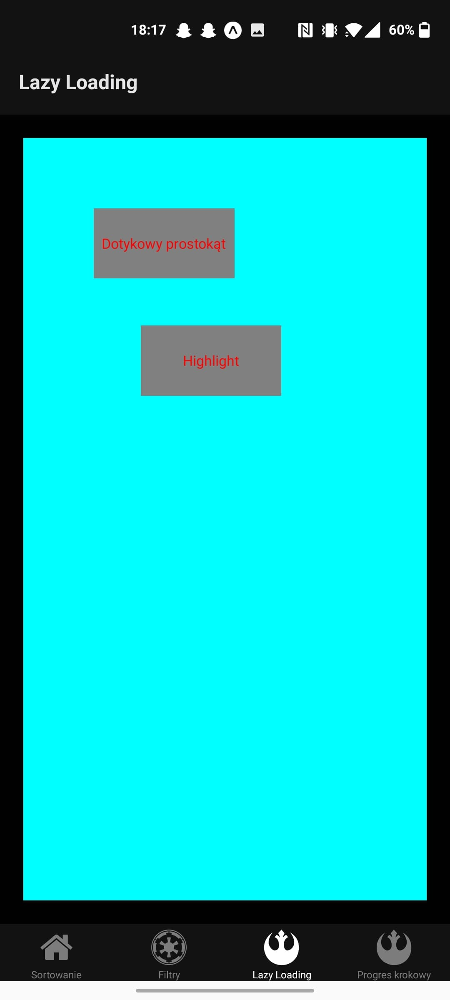
 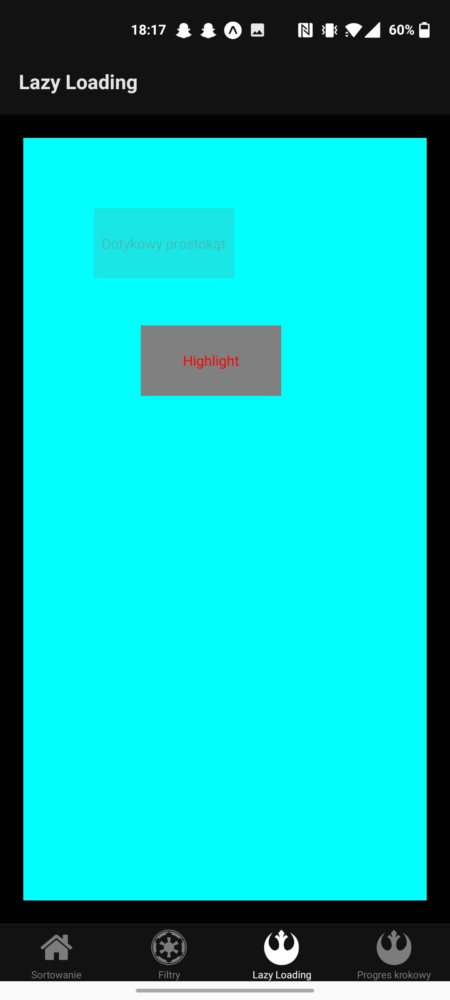
 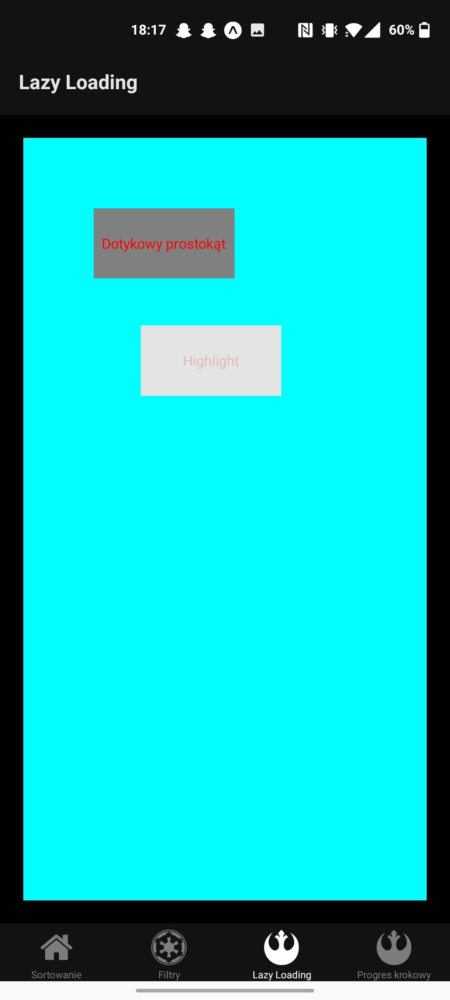
 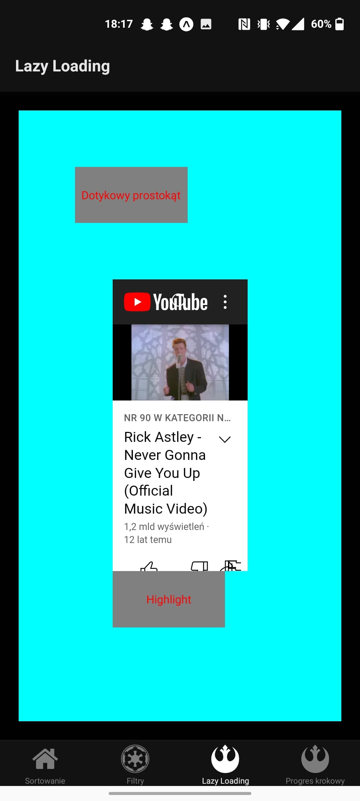
 ## Screen 4, Swipeable
 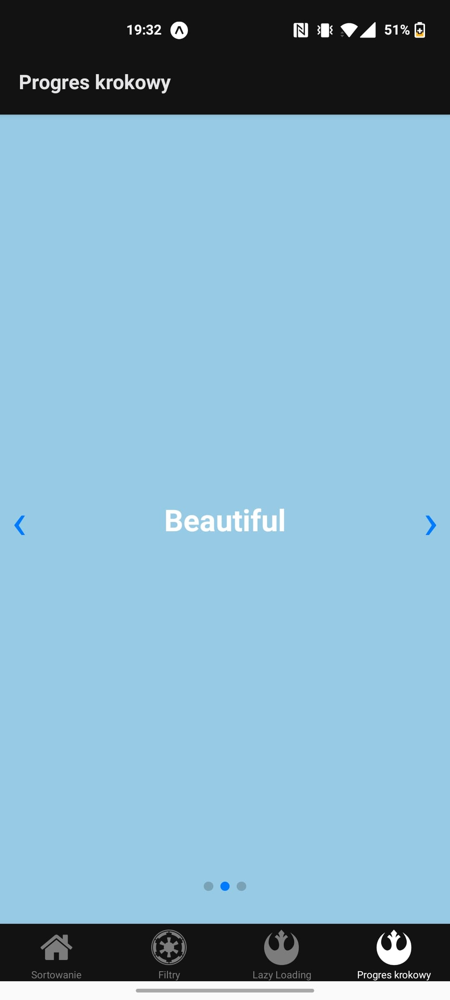
 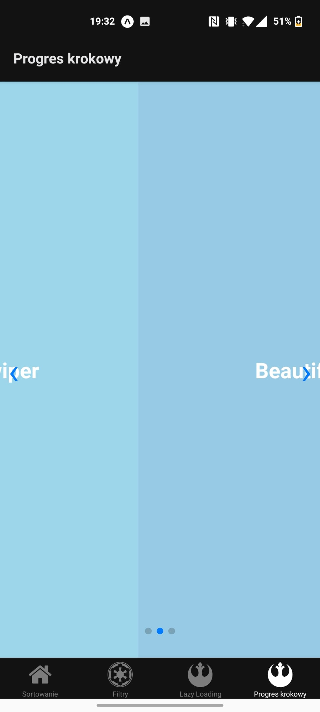
 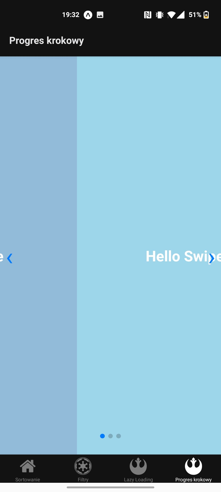
 ## Screen 5, Additional - Pressable component
 
 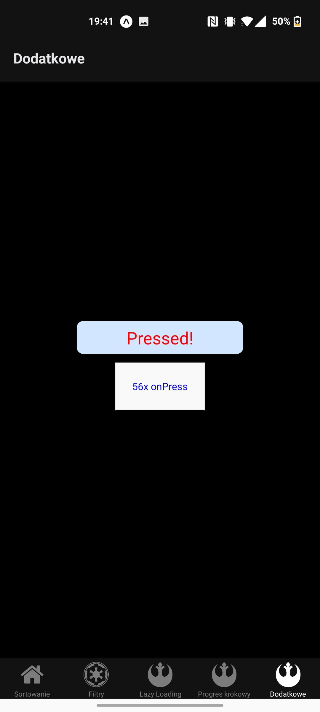
 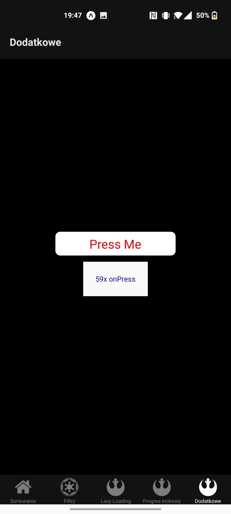