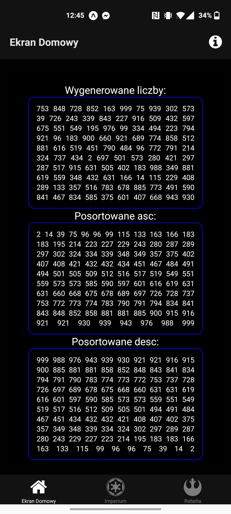
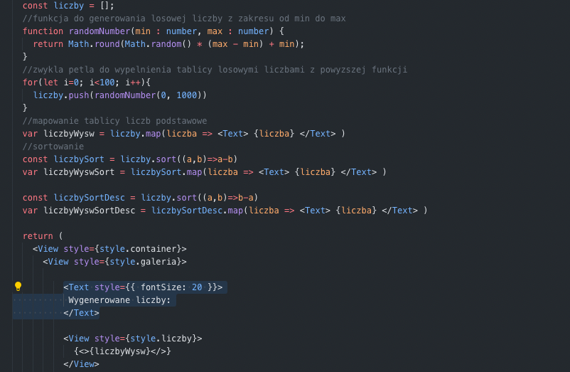
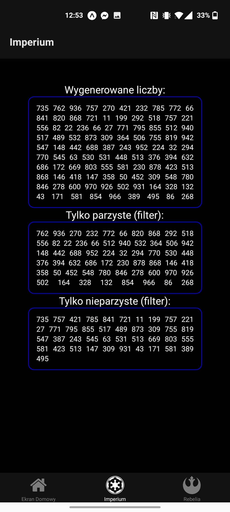
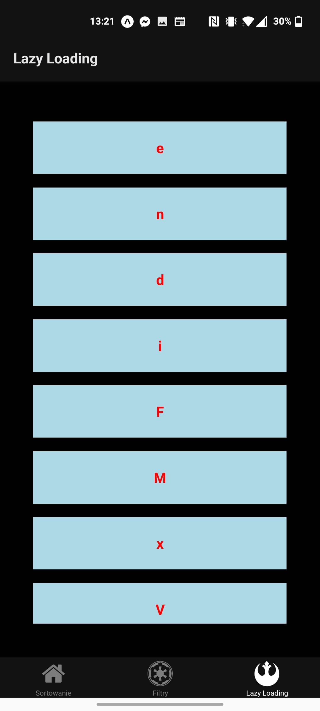
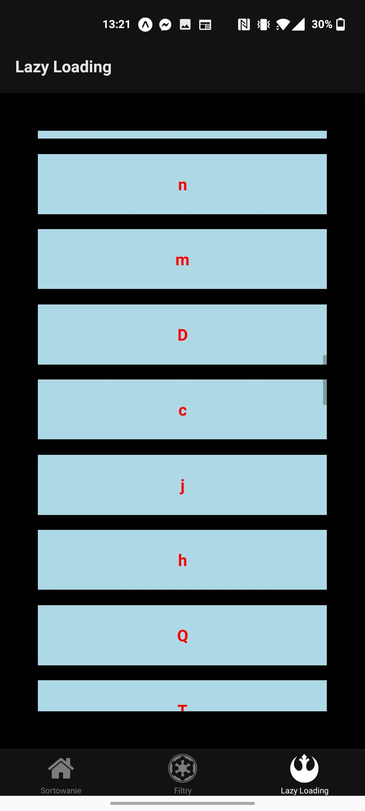
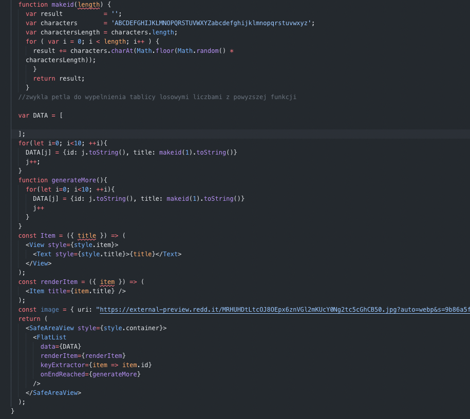
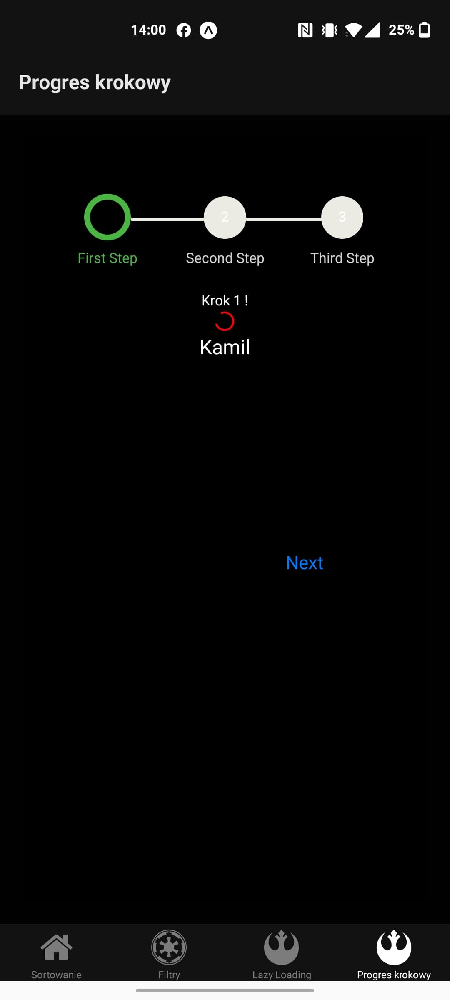
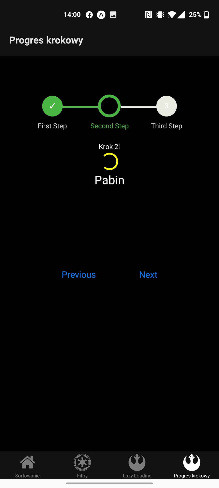
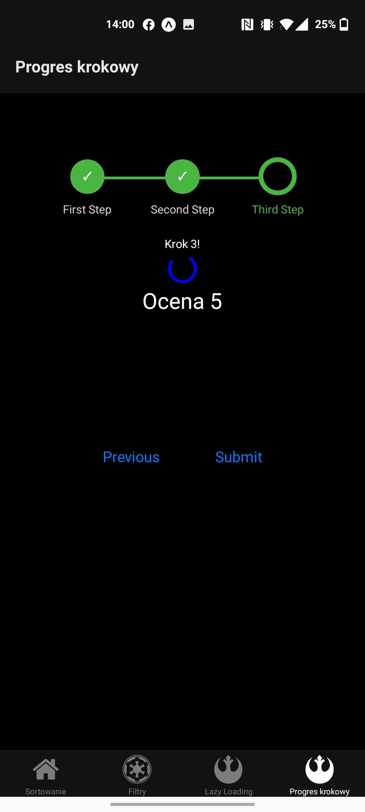
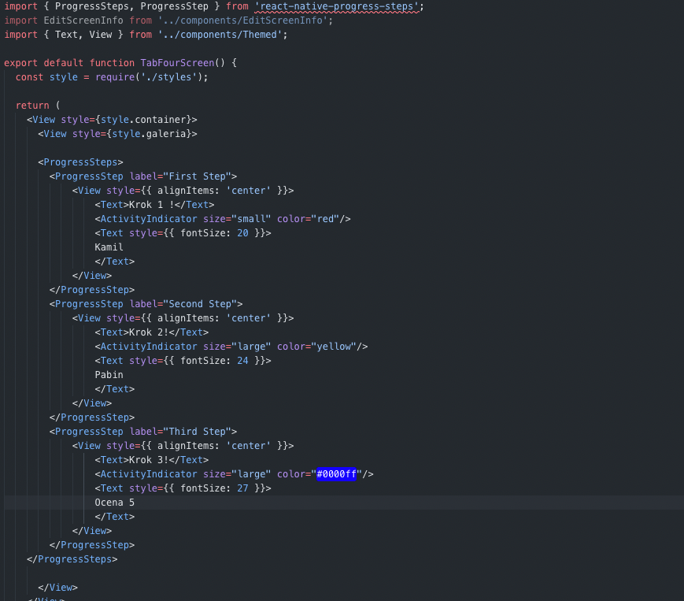

# Laboratorium 3 - renedrowanie-listy-danych-progres

## Cel zadania
Zadanie polegało na stworzeniu programu w którym wygeneruje losowe 100 liczb z zakresu 0-1000, a następnie je wyświetle, wyświetle posortowane, wyświetle filtrowane. Drugą częścią zadania jest stworzenie wyświetlania losowych liter za pomocą lazy loading, a trzecią częścią jest progres krokowy.

## Użyte technologie
Do napisania kalulatora skorzystałem z **React Native** oraz **Expo**, a całość tworzyłem w **VSCode**. Moim urządzeniem do testowania był mój telefon z systemem **Android**.

## Jak to działa
Wykorzystałem funkcje map, sort (zmodyfikowane, żeby sortowało liczbowo), a take filter. Do drugiej części zadania wykorzystałem flatlist, a do trzeciej activity indicator oraz react native progress steps.
## Ekran 1, Generowanie i sortowanie liczb:
 
 
 ## Ekran 2, Generowanie i filtrowanie liczb:
 
 
 ## Ekran 3, Lazy loading i generowanie losowych liter
 
 
 
 ## Ekran 4, Progres Krokowy i Activity Indicator
 
 
 
 