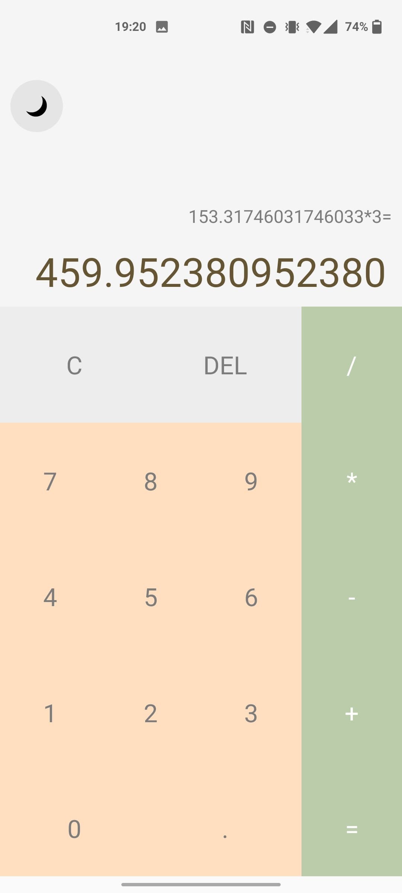
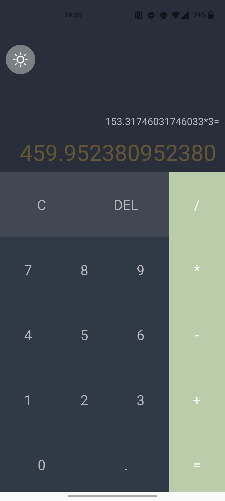
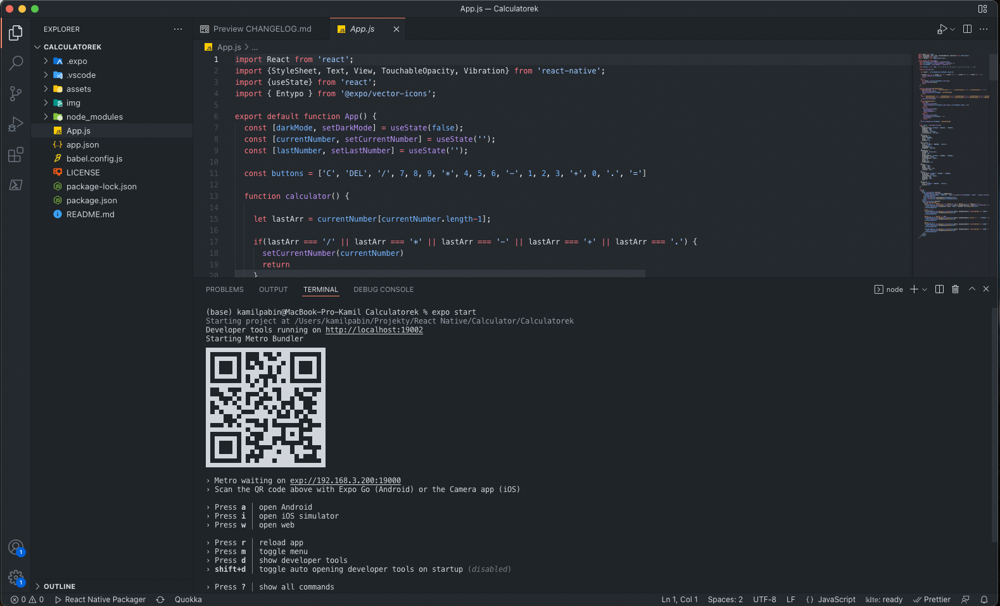

# Project 1 - Calculator

## Purpose of the task
The task was to create a program called 'Calculator' that handles basic mathematical functions. I kept the colors on the military theme, because that is what has been popular recently.

## Technologies used
I used ** React Native ** and ** Expo ** to write the calculator, and I created everything in ** VSCode **. My testing device was my * Android * phone.

## How it's working
To create the application, I did not follow one guide, but several guides, so it's a bit of a patchwork of everything. The entire application is in the * App.js * file, and the configuration in * app.json *.

## The App.js file is the most important:

+ In the first section, I imported the libraries I needed
+ In the second section, I defined the variables for buttons and characters
+ In the next section there are functions of the calculator itself, as well as functions responsible for receiving information from the user (and returning information about the party in the form of vibrations)
+ The next section contains the definition of styles for application elements
+ The last section is rendering elements according to defined styles + choosing the color of individual

## Additional Features
In addition to the basic math functions, I also added a dark / light mode, and (which took 5 minutes) set up the loading screen of the application on my original artwork.

## Standard look of the app
 
## dark-mode
 
## Using expo

