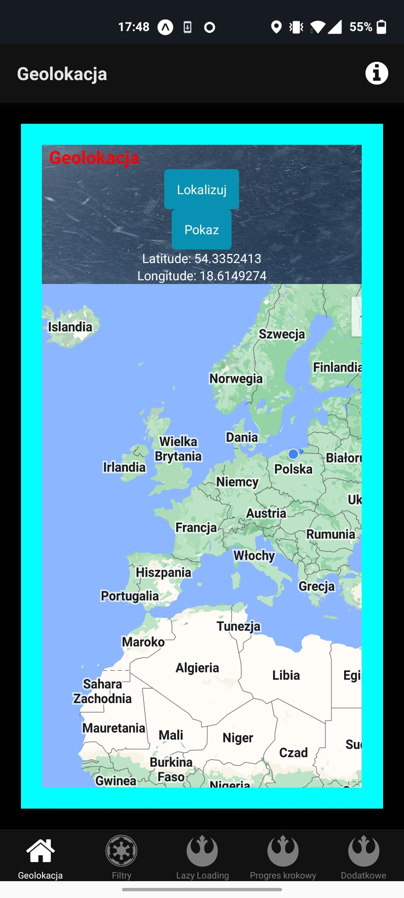

# Project 8

## Purpose of the task
In this task I am using MapView component, to show current localization of an user. I am also using Expo Localization, to access coordinates of the user and display them using state in a text component.

## Technologies used
I used **React Native** and **Expo** to write the app, and I created everything in **VSCode**. My testing device was my *Android* phone.
## Screen 1 Button to update coordinates and a map.
 