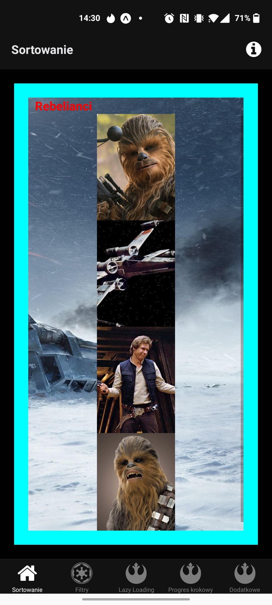
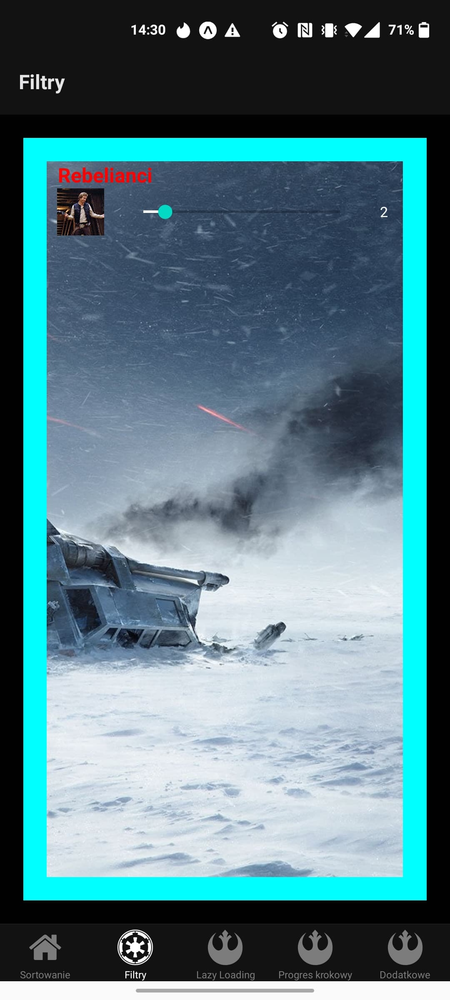
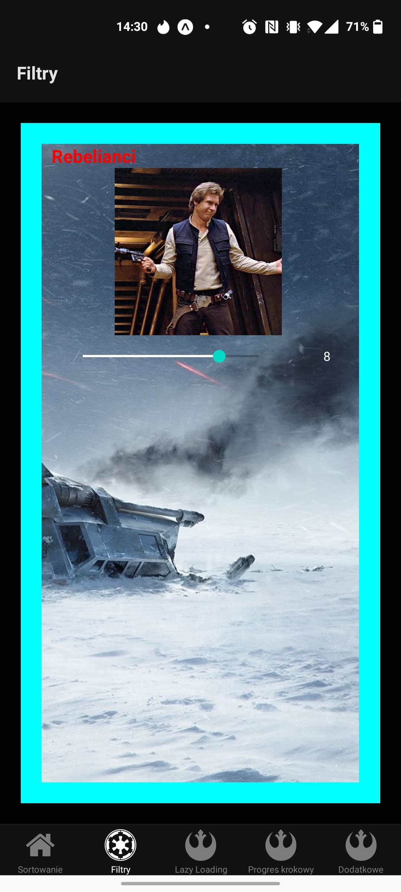
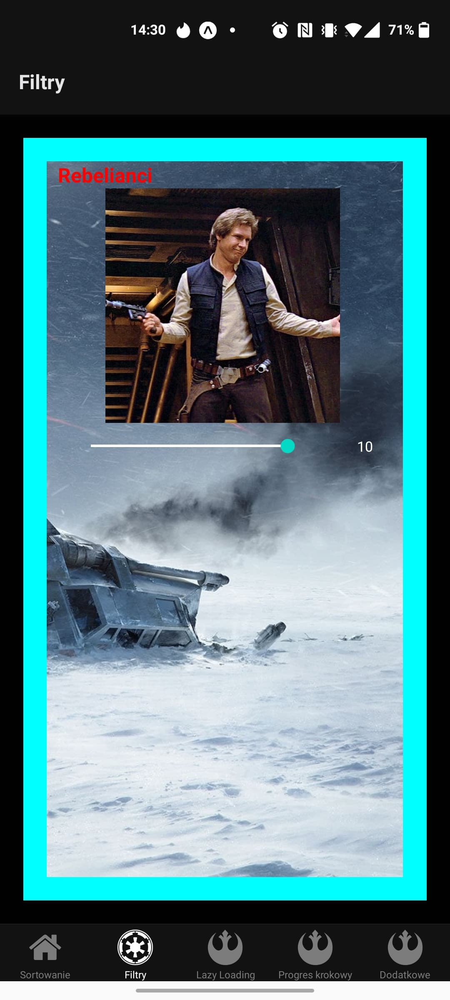
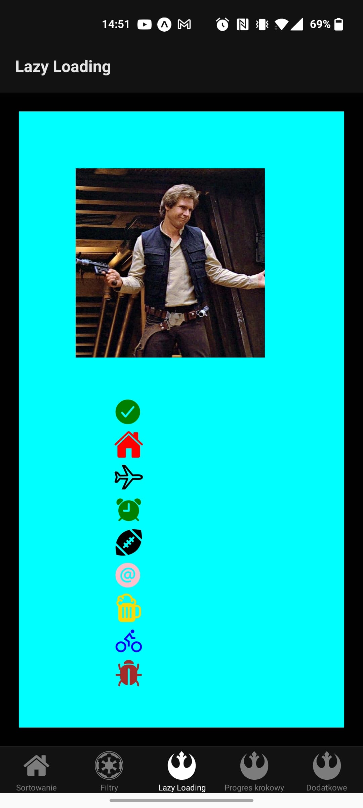
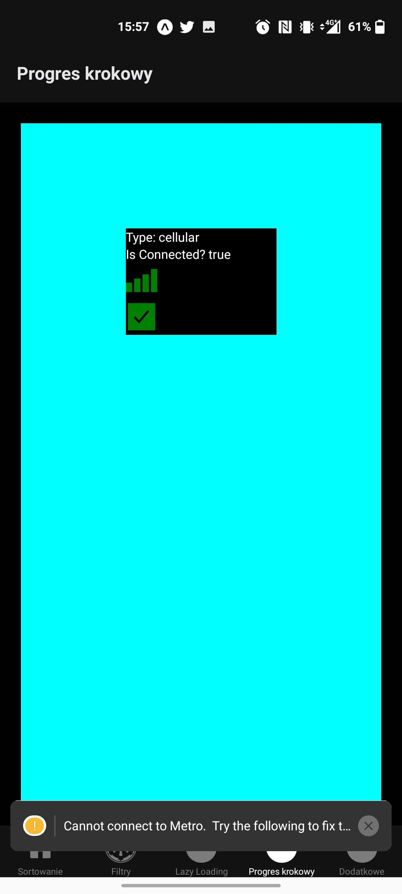
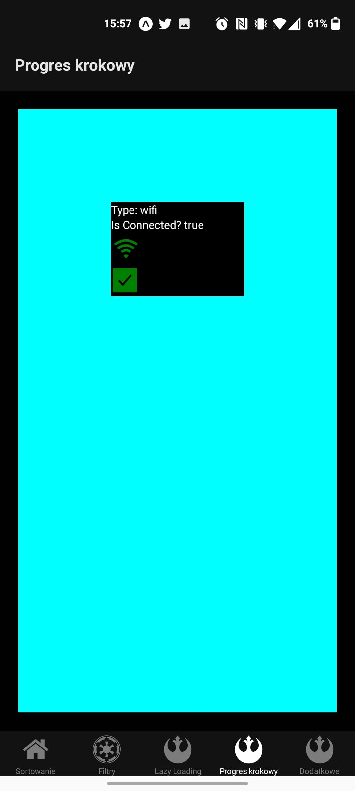
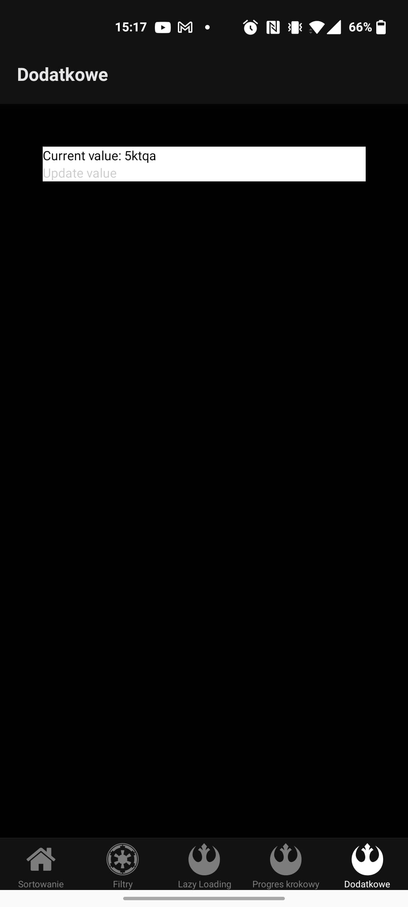
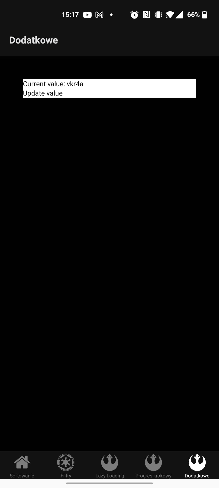

# Project 6

## Purpose of the task
In this task I am using two ways of implementing image component, slider, to manipulate size of the image, lazy loading and icons. Lastly, I am detecting if the app has internet connection and basing on that, manipulating state of the icons. I have also implemented async storage.

## Technologies used
I used **React Native** and **Expo** to write the app, and I created everything in **VSCode**. My testing device was my *Android* phone.
## Screen 1, Images, using URI and Require():
 
## Screen 2, Resizing using slider:
 
 
 
 ## Screen 3, Lazy loading Image and set of icons:
 
 ## Screen 4, Net status and state:
 
 
 ## Screen 5, Async state storage
 
 