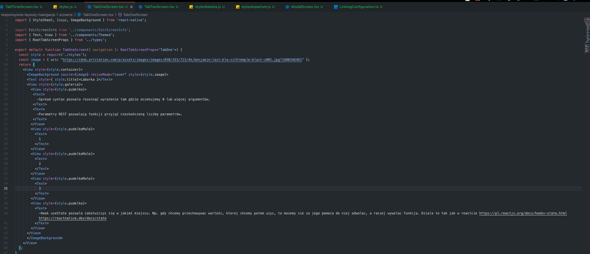
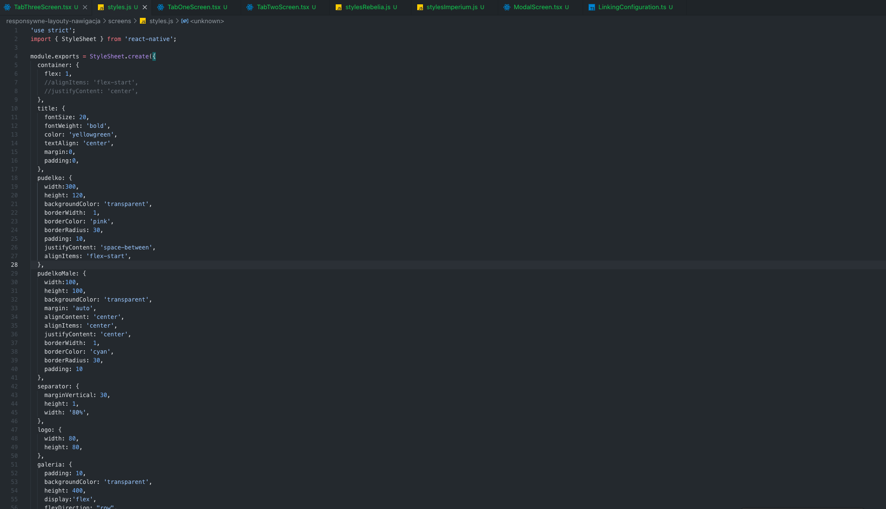
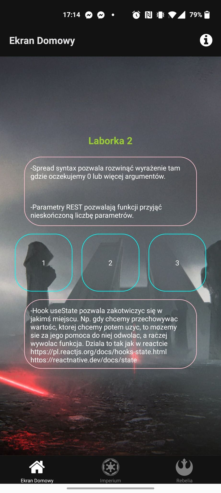
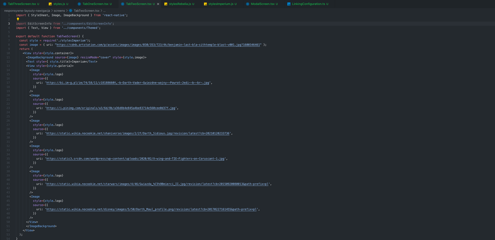
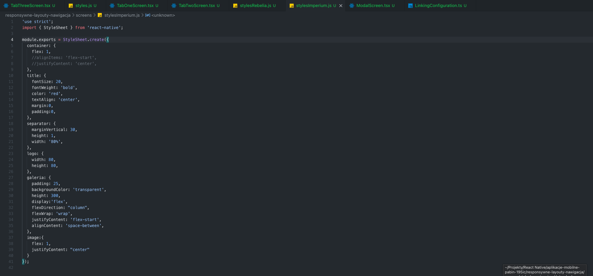
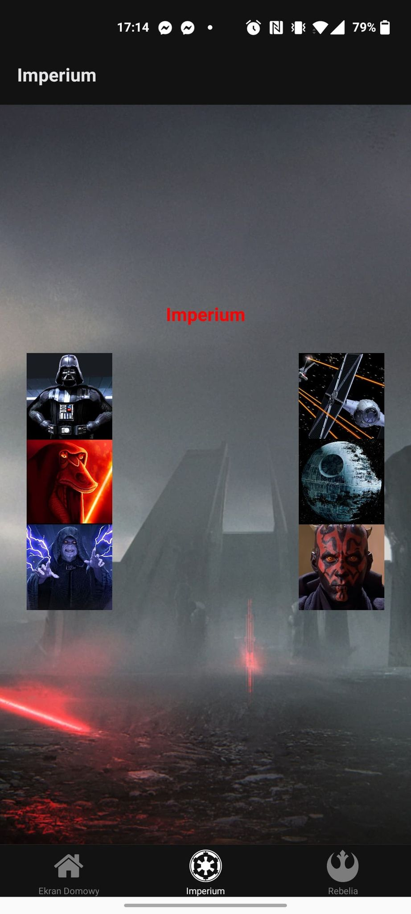
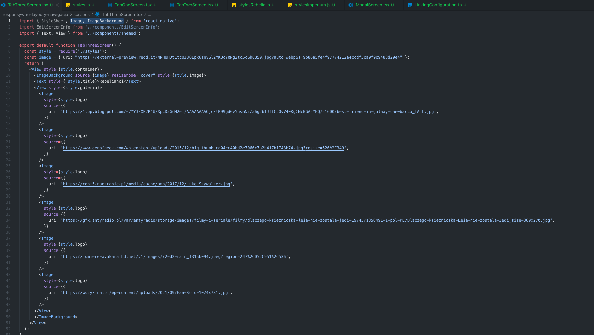
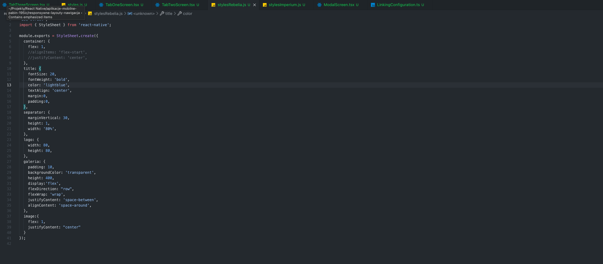
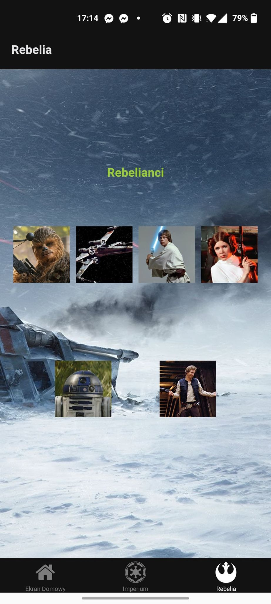

# Lab 2 - Responsive Layouts and Navigation

## Purpose of the task
The task was to create a program in which we can switch between views using buttons. Additionally, in each view we have to use flexbox in a different way.

## Technologies used
I used **React Native** and **Expo** to write the app, and I created everything in **VSCode**. My testing device was my *Android* phone.

## How it's working
Using react-navigation navigation, I created a simple application in which we have 3 tabs, the main theme is Star Wars.
I used different rules for positioning elements in each view, using separate style files for each window.

## Screen 1
 
 
 
 ## Screen 2
 
 
 
 ## Screen 3
 
 
 
